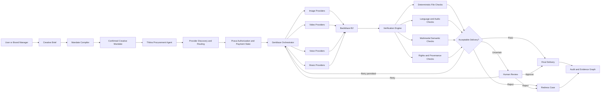
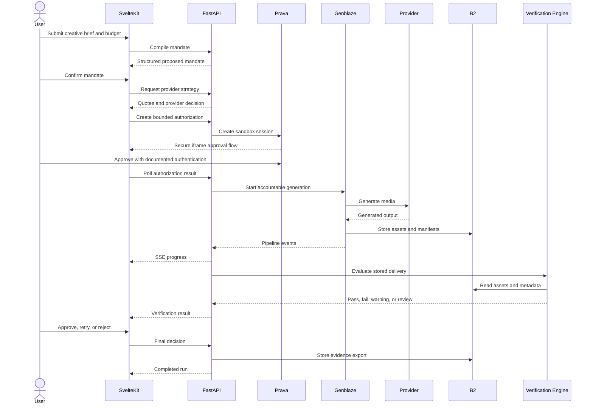

# Thikra architecture

FastAPI owns policy and state. SvelteKit is a same-origin presentation/BFF layer and never receives server secrets. Existing Genblaze catalog, pipeline, storage sink, lineage, and ffmpeg composition code remain the media execution path.

## Boundaries

- `app/repo/provider_catalog.py` is the only provider-class import surface.
- `app/repo/pipelines.py` builds B0 reference, B1 keyframes, and best-effort B2 media and owns standalone OpenAI structured output.
- `app/repo/composer.py` is the only ffmpeg/ffprobe subprocess surface.
- `app/thikra/orchestration.py` resolves catalog entries, executes the preserved pipeline, attaches Thikra context, persists asset records, and starts verification.
- `app/thikra/storage.py` is the sole adapter for non-media JSON evidence; media goes through Genblaze's B2 sink.
- `app/thikra/api.py` exposes typed operations; domain decisions live in services/state policy rather than Svelte.

## State and money

Generation transitions are explicit and invalid changes return stable 409 errors. The confirmed mandate and authorized amount cap every retry. Money is integer minor units plus ISO currency; authorization, invocation, delivery, verification, acceptance, and redress remain separate fields/events.

## Audit integrity

Each event hashes canonical JSON plus the previous hash. UTC normalization keeps the chain stable across SQLite (which strips timezone metadata) and PostgreSQL. Exports contain mandate versions, provider decision, payment references, assets/hashes, evaluations, events, and cases, but never one-time credentials or model chain-of-thought.

## Modes and failure policy

DEMO materializes labeled fixtures. SANDBOX runs real configured Prava and Genblaze/B2 integrations. PRODUCTION performs startup validation and uses explicit CORS origins. Essential B0/B1 preflight remains enabled; B2 stays best-effort. Missing video can fall back to a keyframe, missing audio becomes a warning, but missing all visuals fails. Low confidence, rights uncertainty, policy thresholds, or explicit mandate rules produce human review.
