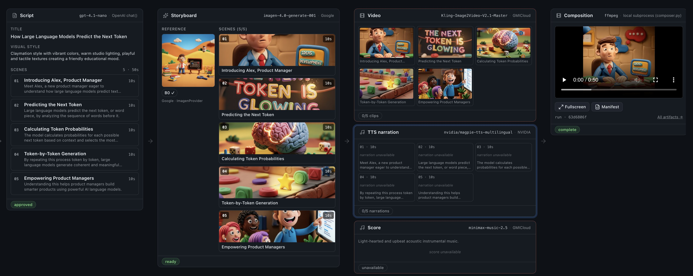

# genblaze-gen-media-multi-provider-sample

> One prompt → narrated, scored, captioned MP4 — a **kitchen-sink test of the
> Genblaze SDK**. Pick any provider per modality (script, image, video, TTS,
> music) and Genblaze orchestrates the run end-to-end. Backblaze B2 is the sole
> asset store; the sample contains zero direct `boto3` calls.

**Building a multi-provider generative-media pipeline used to mean writing
your own glue between a dozen different AI providers — auth, retries, polling,
error handling, asset storage, and lineage tracking, all hand-rolled per
vendor.** This sample shows how [Genblaze][genblaze] collapses that work into
a one-line `.step()` call — and it's a **provider switchboard**: every modality
can be driven by any provider in the catalog, chosen per-run in the UI.
A developer types one sentence and the library orchestrates the whole AI
explainer-video workflow — **storyboard planning** (OpenAI), **keyframe image
generation**, **image-to-video animation**, **text-to-speech narration**, and
**AI music scoring** — then stitches it into a captioned MP4 with ffmpeg.

The catalog spans **OpenAI, Replicate, Google, NVIDIA, Decart, GMICloud,
Runway, Luma, ElevenLabs, LMNT, and Hume**. The default run is the **simplest
path** — just two keys (OpenAI + Replicate), with Replicate covering image,
video, and music. Every intermediate artifact and the composed video land in
Backblaze B2 via `genblaze-s3`. Adding a new provider is one `CatalogEntry`
(see [AGENTS.md](AGENTS.md) Rule 4) — no pipeline edits.



## Pipeline stages

Each stage's provider is chosen per-run from the catalog (`GET /providers`);
the table shows the **simplest-path defaults**. Backblaze B2 is the durable
asset store. See [`docs/features/media-generation.md`](docs/features/media-generation.md)
for the full provider matrix.

| Stage     | Genblaze surface  | Default (selectable)            | Output                |
|-----------|-------------------|---------------------------------|-----------------------|
| A — plan  | `genblaze_openai.chat()` (function) | OpenAI `gpt-4.1-nano` | `StoryboardSpec` JSON |
| B0/B1 — image | `.step()`     | Replicate `flux-schnell`        | reference + 1 PNG/scene |
| B2 — video | `.step()`        | Replicate `minimax/video-01`    | one MP4 per scene     |
| B2 — TTS  | `.step()`         | OpenAI `gpt-4o-mini-tts`         | one WAV per scene     |
| B2 — music | `.step()`        | Replicate `meta/musicgen`       | one WAV for the run   |
| C — compose | (ffmpeg fallback) | —                             | final MP4 → B2        |

Stages B1 and B2 are linked Pipelines sharing one slug
(`genblaze-gen-media-multi-provider-sample`); B2's Manifest records its
`parent_run_id` so the cross-stage lineage is durable in B2.

> **Note on Stage A.** `genblaze-openai` 0.3.0 ships `chat()` as a
> standalone function (not a `BaseProvider`), so the storyboard step
> cannot ride `Pipeline.step()`. We call `chat(..., response_format=StoryboardSpec)`
> directly and persist the resulting JSON to B2 by hand. Stages B1 and B2
> remain proper Pipelines. The function-vs-class asymmetry is filed as
> Genblaze SDK feedback — see `docs/features/prompt-to-storyboard.md`.

## Start free

Every stage's provider is swappable, so you can point the switchboard at
vendors with a **free API tier** and run the generative stages at zero cost.
Below are the providers that let you start free — grab a key and go. (Researched
2026-07; free offers change, so confirm in each console.)

**Fastest path:** point image + video + TTS at **NVIDIA NIM** — free API access,
no credit card, ~40 requests/min ([build.nvidia.com](https://build.nvidia.com)).
Its catalog defaults (`flux.1-schnell` image, `cosmos-2.0` video, `magpie-tts`
narration) cover three of the four generative stages on one free key.

| Provider       | What you get free                                                  | Card? | Stages you can drive           |
|----------------|--------------------------------------------------------------------|-------|--------------------------------|
| **NVIDIA NIM** | Free API access, ~40 RPM (no credit cap since 2025)                | No    | image · video · TTS            |
| **ElevenLabs** | 10,000 credits/mo (~10 min TTS), recurring                         | No    | TTS                            |
| **Hume AI**    | 10,000 chars/mo (~10 min) + reported $20 signup credit             | Likely no | TTS                        |
| **LMNT**       | 15,000 free characters + unlimited voice clones                    | No    | TTS                            |
| **Replicate**  | ["Try for Free"](https://replicate.com/collections/try-for-free) runs + new-account credits | — | image · video · music (metered) |
| **Decart**     | Free API credits on new accounts                                   | Unknown | image · video                |

The leanest end-to-end free run: **NVIDIA** for image + video + narration, and a
free-tier voice from **ElevenLabs**, **Hume**, or **LMNT** if you want a
different sound. The one unavoidable cost is **Stage A (storyboard)**, which
rides OpenAI's `chat()` structured-output path — no reliable free tier there, so
budget a few cents for planning.

## Quickstart

### 1. Provision accounts

- **Backblaze B2** — create a bucket + Application Key
  ([signup](https://www.backblaze.com/sign-up/cloud-storage)). Region
  format: `us-west-004` / `eu-central-003` / etc.
The **simplest path needs just two provider keys** — set these to run out of
the box:

- **OpenAI** — storyboard planning (Stage A) + TTS narration
  ([platform.openai.com](https://platform.openai.com/)).
- **Replicate** — image, video, AND music with one token
  ([replicate.com](https://replicate.com/account/api-tokens)).

**Optional** — set any of these to unlock more switchboard choices: **Google**
(Imagen/Veo), **NVIDIA NIM** ([build.nvidia.com](https://build.nvidia.com/)),
**Decart** ([decart.ai](https://decart.ai/)), **GMICloud**
([gmicloud.ai](https://www.gmicloud.ai/)), **Runway**, **Luma**, **ElevenLabs**,
**LMNT**, **Hume**. Vendors without a configured key are greyed out in the UI.

### 2. Install ffmpeg

The composer shells out to `ffmpeg`; install it before running:

```bash
# macOS
brew install ffmpeg
# Debian / Ubuntu
sudo apt-get update && sudo apt-get install -y ffmpeg
```

See `infra/README.md` for B2 bucket + lifecycle suggestions.

### 3. Configure

```bash
cp .env.example .env
# Fill in B2_* + provider keys. Replace <region> in B2_REGION with the
# region the bucket was created in (e.g. us-west-004). genblaze-s3
# derives the S3 endpoint from the region — no B2_ENDPOINT needed.
```

### 4. Install + run

From the sample root:

```bash
pnpm setup    # one-shot: pnpm install + creates services/api/.venv and pip-installs requirements.txt
pnpm dev      # starts FastAPI (:8000) and Next.js (:3000) together via concurrently
```

That's it — no separate terminals. Output is prefixed `[web]` / `[api]` so
you can follow both streams in one log. Ctrl+C stops both.

Re-runs after the first time skip `setup` and just `pnpm dev`. Other
scripts: `pnpm test`, `pnpm lint`, `pnpm typecheck`, `pnpm check:structure`.

Open <http://localhost:3000>, type one sentence, click **Generate
explainer**. The storyboard renders inline; expand "Review & refine" to
edit scenes before kicking off media generation. Live pipeline events
stream as the run progresses, and per-scene keyframes / clips / narrations
appear in the scene strip as they land.

## Architecture

```
apps/web (Next.js, App Router, React 19)
    │
    │  /api/proxy/...
    ▼
services/api (FastAPI)
    │
    │  app/main.py ─► app/repo/pipelines.py ─► provider_catalog.py ─► genblaze-{core,s3,
    │                                          openai,google,nvidia,decart,gmicloud,replicate,
    │                                          runway,luma,elevenlabs,lmnt,hume}
    │                  app/repo/composer.py  ─► system ffmpeg (only non-Genblaze adapter)
    │
    ▼
Backblaze B2 (bucket: $B2_BUCKET_NAME, prefix: explainers/<run-id>/...)
```

See [`ARCHITECTURE.md`](ARCHITECTURE.md) for the layer diagram, Stage A/B1/B2/C
handoffs, ethos constraints, and the SSE wire format.

## Repository layout

```
genblaze-gen-media-multi-provider-sample/
├── apps/web/                  # Next.js single-page UI
├── services/api/              # FastAPI + Genblaze (boto3 forbidden)
│   ├── app/repo/provider_catalog.py # The ONLY file importing genblaze provider classes
│   ├── app/repo/pipelines.py  # Resolves CatalogEntry.make(); imports only chat() + core
│   ├── app/repo/composer.py   # ffmpeg composer (only non-Genblaze media surface)
│   └── tests/                 # Structural + smoke + composer tests
├── docs/                      # Feature docs + workflows
├── infra/                     # B2 bucket + ffmpeg setup notes
└── .env.example               # Parent-standard env var names
```

## Key features

- **One prompt → one MP4.** Default path is a single textarea and one CTA.
- **Mixed Genblaze surfaces, one delivery.** Stage A is `chat()` (function),
  Stages B1/B2 are `Pipeline.step()` (class), Stage C is ffmpeg. The
  pipeline layer hides the asymmetry from the API surface.
- **Structured planning via `response_format=StoryboardSpec`.** The
  storyboard JSON schema is enforced upstream by OpenAI.
- **Per-scene fan-out at `max_concurrency=3`.** Genblaze handles the
  parallelism in Stages B1 and B2; the sample provides no executor.
- **Live SSE pipeline progress + per-scene strip.** Stage B1 + B2 events
  flow through the FastAPI proxy unmodified; keyframes / clips /
  narrations appear in `SceneStrip` as soon as they land in B2.
- **Optional progressive guidance.** Edit any scene's prompts before
  media generation runs — opt-in via a disclosure panel.
- **Provenance for free.** Stages B1 + B2 share one slug; B2's Manifest
  records `parent_run_id` to capture lineage. The final MP4 has the
  Stage B2 Manifest embedded via `Mp4Handler`.

## Doc index

- [`AGENTS.md`](AGENTS.md) — hard rules for AI assistants working on this app.
- [`ARCHITECTURE.md`](ARCHITECTURE.md) — layers, ethos constraints, SSE wire format.
- [`docs/app-workflows.md`](docs/app-workflows.md) — one-prompt-to-MP4 sequence diagram.
- [`docs/features/prompt-to-storyboard.md`](docs/features/prompt-to-storyboard.md) — the `chat(response_format=…)` idiom.
- [`docs/features/media-generation.md`](docs/features/media-generation.md) — keyframes, image→video, TTS, music.
- [`docs/features/composition.md`](docs/features/composition.md) — ffmpeg fallback + SDK gap.
- [`docs/features/progressive-guidance.md`](docs/features/progressive-guidance.md) — optional refine flow.

[genblaze]: https://github.com/backblaze-labs/genblaze
