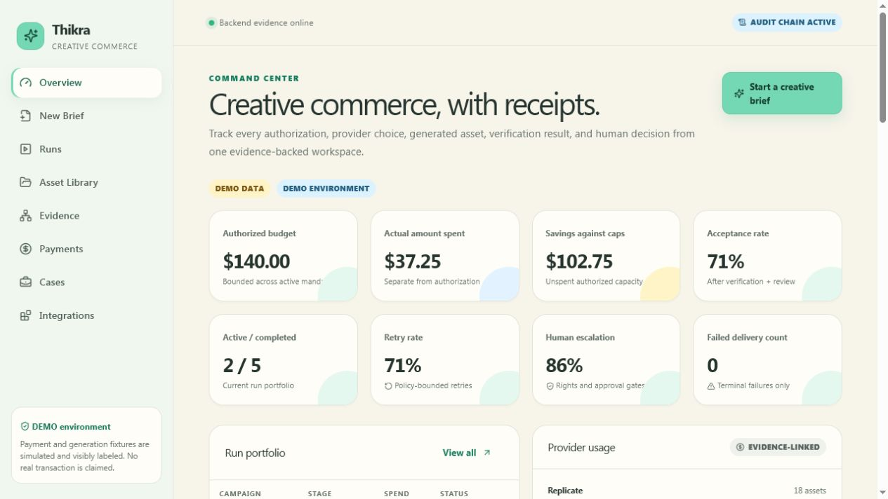
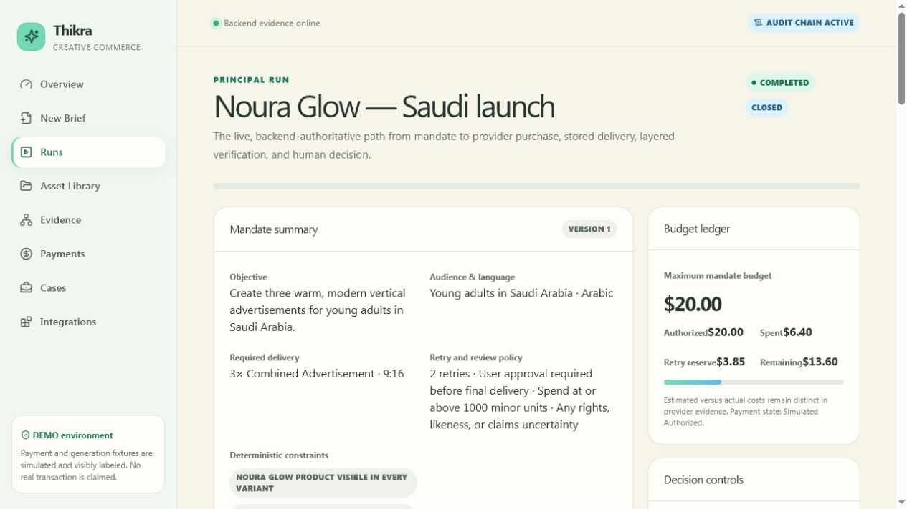

# Thikra

Thikra is a verify-then-pay creative-commerce application. A brand manager turns a brief into a versioned mandate, compares Genblaze providers, grants a bounded Prava authorization, reviews generation and verification evidence, and either accepts delivery, retries a failed component, rejects it, or opens a redress case.

The active product is SvelteKit 2 / Svelte 5. The original Next.js frontend is retained under `reference/next-web` only for migration history. FastAPI remains authoritative; Genblaze remains the provider orchestration layer; Backblaze B2 remains the durable media store; ffmpeg remains the sole composition surface.

## Product preview





The responsive command center is also verified at a 390×844 mobile viewport: [mobile preview](docs/demo/thikra-overview-mobile.png).

## What works

- Seven-step brief, mandate review/versioning, provider strategy, authorization, and launch flow.
- Editable planned scenes that become immutable when generation starts.
- Official Prava secure iframe integration in sandbox mode; keys and one-time credentials stay server-side.
- Focused Prava `$0` sandbox diagnostic at `/payments/prava-test`, including passkey readiness, iframe events, polling, and a hosted-page fallback.
- Preserved Genblaze storyboard → keyframe → video/narration/music → ffmpeg path in sandbox/production.
- B2 media metadata, lineage, hashes, server-side short-lived downloads, and one evidence JSON adapter.
- SSE with stable envelopes, deterministic IDs, resume cursor, deduplication, reconnect backoff, and polling fallback.
- Layered verification records, with real Pillow/ffprobe inspection for non-demo delivery.
- Backend-enforced retry budgets, approval/rejection policy, redress cases, and a tamper-evident SHA-256 audit chain.
- Complete Overview, New Brief, Runs, Asset Library, Evidence, Payments, Cases, and Integrations routes.
- Seeded Noura Glow demo with one controlled missing-narration failure, retry, human review, payment history, assets, evidence, and case history.

## Quick start

Prerequisites: Node.js 20+, pnpm 9+, Python 3.11+, [uv](https://docs.astral.sh/uv/), and ffmpeg/ffprobe on `PATH`.

```powershell
Copy-Item .env.example .env
pnpm setup
pnpm dev
```

The same `pnpm setup` and `pnpm dev` commands work in PowerShell, cmd, macOS, and Linux because environment setup and process launch use Node scripts. `pnpm dev` applies pending Alembic migrations before starting FastAPI. Open [http://localhost:43191](http://localhost:43191). FastAPI and OpenAPI run at [http://localhost:43192/docs](http://localhost:43192/docs).

On Windows, stop all local Thikra web/API process trees with `pnpm stop:windows` or run
`.\scripts\stop-app.ps1` directly from PowerShell. Use `.\scripts\stop-app.ps1 -WhatIf` to
preview the exact PIDs without stopping anything. The script targets only listeners on ports
43191, 43192, and 43292 plus their related Thikra launcher processes.

## Runtime modes

| Mode | Behavior |
|---|---|
| `DEMO` | Zero paid credentials. Seeds local SQLite, simulated payment records, local evidence JSON, and committed media fixtures. Every simulated action is labeled. |
| `SANDBOX` | Real Prava sandbox and configured Genblaze/B2 integrations. Missing provider keys are shown as unavailable. Genblaze provider API billing and Prava authorization are recorded separately. |
| `PRODUCTION` | Startup refuses default session secrets or missing Prava/B2 configuration. No demo payment gateway is selected; CORS uses only explicit origins. |

Copy `.env.example` and set `APP_MODE`. Real sandbox work needs `PRAVA_PUBLISHABLE_KEY`, `PRAVA_SECRET_KEY`, all four `B2_*` values, `OPENAI_API_KEY`, and at least one configured provider for each selected modality. No secret is exposed through the browser bundle or health responses.

Prava's official skill currently documents session creation, secure iframe authorization, result polling, one-time credential handling, outcome reporting, and revocation. It does not document a webhook signature contract, refund API, or a card-checkout contract for the selected AI providers. Thikra returns an explicit unsupported response and opens redress instead of calling invented APIs. See the [Prava merchant flow](docs/integrations/PRAVA_MERCHANT_FLOW.md).

## Commands

```text
pnpm setup             install frontend and API dependencies
pnpm dev               run SvelteKit :43191 and FastAPI :43192
pnpm stop:windows      stop local Thikra web/API processes from PowerShell
pnpm dev:agent         run the separate external buyer agent
pnpm demo:agent        run the isolated MCP-to-delivery demonstration
pnpm demo:human        run the human marketplace demonstration
pnpm seed:commerce     seed the commerce catalog and demo developer identity
pnpm build             build the SvelteKit Node application
pnpm lint              ESLint + Ruff
pnpm typecheck         svelte-check
pnpm test              backend and frontend unit/integration tests
pnpm test:commerce     commercial domain, REST, and MCP tests
pnpm test:mcp          real MCP-client integration test
pnpm test:e2e          Playwright end-to-end demo
pnpm check:structure   frontend and backend architectural guards
```

## Agent-accessible creative commerce

External agents discover Thikra through `/.well-known/thikra-services.json`, the A2A Agent Card, UCP profile, OpenAPI, or authenticated MCP at `/mcp/`. Commerce is a layer above generation:

`ServiceOffer → Quote → CommercialOrder → authorization → payment → FulfillmentJob → existing GenerationRun → verified Deliverable → signed DeliveryReceipt → dispute/redress`.

Six services are visible at `/services`; integration guidance is at `/developers`; authenticated orders are at `/commercial-orders`. The separate `apps/agent-client` proves the contract using the official MCP client and local `@thikra/sdk`. See the [external agent demo](docs/demo/EXTERNAL_AGENT_DEMO.md), [REST guide](docs/agent-gateway/REST.md), and [MCP guide](docs/agent-gateway/MCP.md).

## Architecture

```text
Browser → same-origin SvelteKit BFF → FastAPI policy/domain service
                                      ├─ Prava authorization adapter
                                      ├─ Genblaze provider catalog + pipelines
                                      ├─ Backblaze B2 / local evidence adapter
                                      ├─ Pillow + ffprobe verification
                                      ├─ SQLAlchemy / SQLite or PostgreSQL
                                      └─ tamper-evident audit + redress
```

See [ARCHITECTURE.md](ARCHITECTURE.md), [data model](docs/architecture/data-model.md), [state machines](docs/architecture/state-machines.md), and [evidence model](docs/architecture/evidence-model.md).

## Repository

```text
apps/web/                 active SvelteKit product and Playwright test
apps/agent-client/        external MCP/REST buyer-agent demonstration
packages/thikra-sdk/      local typed TypeScript commerce client
reference/next-web/       archived original UI, excluded from workspace
services/api/app/repo/    preserved provider catalog, Genblaze pipelines, composer
services/api/app/thikra/  mandate, payment, run, verification, evidence, cases
services/api/app/commerce catalog, quotes, orders, delivery, webhooks
services/api/app/agents/  shared gateway facade and MCP adapter
services/api/migrations/  Alembic migration
docs/                     architecture, integrations, demo, submissions
scripts/                  cross-platform setup and task runners
```

## Demo

Start in `DEMO`, open **New Brief**, and use the prefilled Noura Glow scenario. Compile and confirm the mandate, inspect provider scores, authorize the clearly simulated bounded payment, launch, edit or confirm the storyboard, watch SSE progress, retry the missing Arabic narration, approve the result, then inspect Assets, Payments, Evidence, and Cases. The exact talk track is in [DEMO_SCRIPT.md](docs/demo/DEMO_SCRIPT.md).

## Deployment and attribution

Docker Compose, PostgreSQL, the SvelteKit Node adapter, FastAPI, and ffmpeg are documented in [DEPLOYMENT.md](docs/DEPLOYMENT.md). This project began from Backblaze's Genblaze multi-provider sample; the precise pre-existing/new-work boundary is in [PREEXISTING_WORK_DISCLOSURE.md](docs/hackathons/PREEXISTING_WORK_DISCLOSURE.md) and [MIGRATION_NOTES.md](MIGRATION_NOTES.md).
